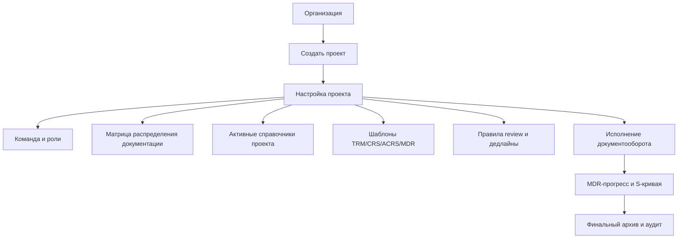

# Целевая модель веб-решения для ТДО/MDR (выравнивание по процедурам)

Документ фиксирует To-Be логику системы по вашим регламентам с учетом роста:
- несколько проектов в одном решении;
- много пользователей/подрядчиков/разработчиков;
- гибкие справочники (не все категории обязательны в каждом проекте);
- просмотр документов прямо на сайте.

## Источники, использованные для выравнивания
- `IVA-DC-PCJ-00302-00-BI.docx` — процедура рассмотрения/согласования ТД.
- `IVA-PС-PCJ-00401-00-BI.docx` — требования к формированию и актуализации MDR.

---

## 1) Уровень 0: мультипроектная модель



### Продуктовые принципы
1. Один сайт, много проектов, изоляция данных и прав по проектам.
2. Один пользователь может иметь разные роли в разных проектах.
3. Справочники и статусы включаются профилем проекта, а не глобально "все сразу".

---

## 2) Уровень 1: нормативный workflow документа (TRM + review + MDR)

```mermaid
flowchart TD
    A[Документ внесен в MDR\n(ключ, коды, дисциплина, атрибуты)] --> B[Подготовка пакета на выпуск]
    B --> B1[Searchable PDF + editable file/ZIP]
    B1 --> C[Формирование TRM\nодна цель выпуска на TRM]
    C --> D[Официальная отправка\nпортал/email/TDMS]
    D --> E[Входной контроль ТДО Заказчика]
    E --> F{Есть замечания к\nоформлению/комплектности/TRM?}
    F -- Да --> G[Возврат на исправление\nTRM номер не меняется]
    G --> C
    F -- Нет --> H[Распределение LR/дисциплинам\nпо матрице]
    H --> I[Рассмотрение и CRS]
    I --> J[Код рассмотрения\nAP/AN/CO/RJ]
    J --> K{AP?}
    K -- Да --> L[Переход цели выпуска\n(IFR->IFD/IFC/IFU/AFP...)]
    K -- Нет --> M[Подрядчик формирует ACRS\n+ корректирует документ]
    M --> N[Повторный выпуск ревизии\nс новым TRM]
    N --> E
    L --> O[Обновление MDR\nстатус, коды, даты, TRM]
    O --> P[Финальный выпуск и архив]
```

### Обязательные правила из процедуры, которые нужно заложить в систему
- Без TRM и официального уведомления пакет считается **не переданным**.
- При отклонении на входном контроле документ **не идет в review**.
- Повторная подача после входного контроля идет **без смены номера TRM**.
- Комментарии передаются через **CRS**, ответы — через **ACRS**.
- ACRS отправляется **только вместе с откорректированной документацией**.
- Отсутствие ACRS может быть основанием отклонения исправленного пакета.
- Документы, полученные после 16:00 МСК/в нерабочий день, считаются полученными на следующий рабочий день.

---

## 3) Цели выпуска и ревизии (для автоматики статусов)

### Цели выпуска (Issue Purpose)
Поддержать как справочник и валидировать на уровне TRM/MDR:
- `IFI`, `IFR`, `IFH`, `IFD`, `IFQ`, `IFP`, `IFU`, `AFP`, `IFC`, `AFC`, `ASB`, `SUP`, `VOID`.

### Базовые переходы целей выпуска (из процедуры)
- Для ПД: `IFR -> IFD`
- Для РД: `IFR -> IFC`
- Для закупки: `IFQ/IFP -> AFP`
- Для процедур/управленческих документов: `IFR -> IFU`

### Код ревизии
- Буквенные ревизии (A, B, ...) для review-этапа IFR.
- Числовые (например `00`) после снятия замечаний и смены цели выпуска (IFD/IFC и т.д.).
- Для `VOID/SUP` — отдельные правила и обязательная фиксация в MDR.

---

## 4) MDR как "хребет" системы учета

### Управление MDR
- Базовая редакция MDR согласуется с Заказчиком в срок до 30 календарных дней от договора (или иной согласованный срок).
- Изменения MDR согласуются с Заказчиком.
- `Document Key` фиксируется на этапе базового MDR и далее не меняется.
- Записи из MDR не удаляются физически: изменения отражаются в полях/статусах.

### Прогресс и S-кривая
Система должна считать план/прогноз/факт и строить S-кривую.
Ключевые шаги прогресса, зафиксированные в процедуре:
- 10%, 15%, 25%, 50%, 70%, 75%, 80%, 85%, 90%, 100%.

Связка с документооборотом:
- 70%: выпуск IFR rev.A.
- 75%: review результата rev.A.
- 80%: выпуск IFR rev.B (если есть второй цикл).
- 85%: review результата rev.B.
- 90%: выпуск IFD rev.00.
- 100%: получение согласования Заказчика.

Для каждого шага хранить:
- `Plan Date`, `Forecast Date`, `Fact Date`,
- подтверждающий `TRM Number`,
- `Review Code` (где применимо).

---

## 5) Роли и доступы (с учетом роста команды)

Минимальный набор ролей:
- `Org Admin` — организации и проекты;
- `Project Admin` — настройки проекта и матриц;
- `Document Controller (DCC/TDO)` — входной контроль, маршруты TRM, регистры;
- `MDR Specialist` — контроль MDR и связки с TRM Register;
- `Author/Engineer` — разработка и перевыпуск документов;
- `Lead Reviewer (LR)`/`Reviewer` — консолидация комментариев, review codes;
- `Approver` — финальное согласование;
- `Viewer` — чтение финальных выпусков.

Техническая модель: `RBAC + Project Scope + Audit Trail`.

---

## 6) Гибкие справочники (чтобы не тащить всю иерархию в UI)

Проблема: в регламентах полный набор категорий/кодов, но проекту нужна часть.

Решение:
1. Глобальный мастер-справочник.
2. `ProjectDictionaryConfig` — профиль активных значений проекта.
3. UI показывает только активные значения проекта.
4. Деактивированные элементы сохраняются в истории старых документов, но скрываются для новых.

---

## 7) Viewer на сайте (обязательно для процесса review)

Требования к MVP:
1. Просмотр документов в браузере без скачивания.
2. Привязка комментариев к странице/области.
3. Поддержка redline/track-режима на уровне вложений к CRS (минимум как attachment/link).
4. Хранение оригинала + web-представления для просмотра.

Рекомендуемый путь:
- использовать готовый viewer (например PDF.js как старт),
- бизнес-логику CRS/ACRS/TRM/MDR реализовать собственную.

---

## 8) Минимальная модель данных

- `Organization`, `Project`, `ProjectMember`
- `Role`, `Permission`, `ProjectRoleAssignment`
- `Dictionary`, `DictionaryItem`, `ProjectDictionaryConfig`
- `Document`, `Revision`, `IssuePurpose`, `RevisionCode`
- `Transmittal`, `TransmittalItem`, `TRMRegister`
- `IncomingCheck` (входной контроль), `DistributionMatrix`
- `CRS`, `CRSItem`, `ACRS`
- `ReviewDecision` (Review Code + LR decision)
- `MDRRecord`, `MDRProgressSnapshot`
- `AuditEvent`, `Attachment`

---

## 9) Что дальше

Следующий практический шаг: на основе этого документа разложить UI по экранам:
1. Проекты и настройки.
2. Реестр документов (MDR-centric).
3. Карточка документа и ревизии.
4. TRM центр.
5. Входной контроль.
6. Review (CRS/ACRS + viewer).
7. Отчеты/S-кривая/прогресс.
