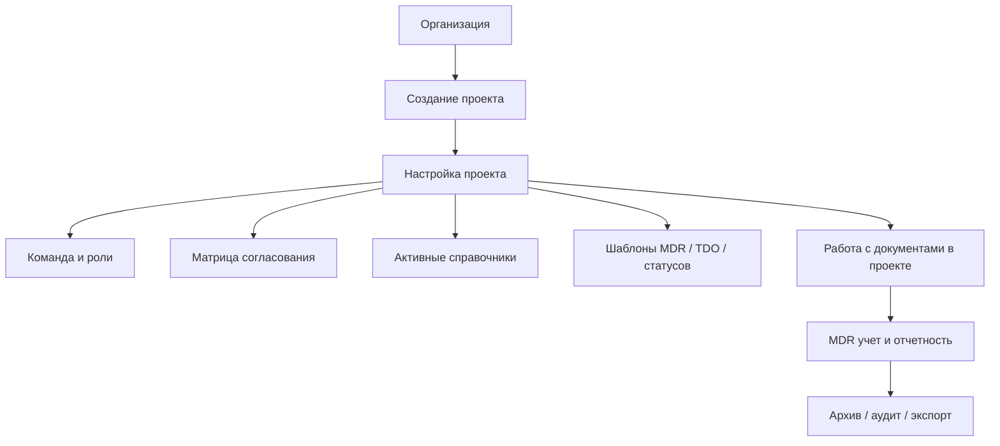

# Целевая модель веб-решения для ТДО/MDR

Документ фиксирует целевую логику системы под ваши процедуры с учетом масштабирования:
- несколько проектов в одном решении;
- много пользователей/разработчиков/подрядчиков;
- гибкие справочники (не все категории обязательны в каждом проекте);
- просмотр документов прямо в интерфейсе сайта.

---

## 1) Уровень 0: мультипроектное решение



### Что это значит для продукта
1. **Один сайт, много проектов**: каждый проект изолирован по данным и правам.
2. **Единый аккаунт пользователя**: один человек может состоять в нескольких проектах с разными ролями.
3. **Конфигурация на уровне проекта**: проект сам включает только нужные типы документов, статусы и справочники.

---

## 2) Уровень 1: workflow документа (TDO + MDR)

```mermaid
flowchart TD
    A[Регистрация документа в MDR\nDocument Code, Title, Discipline, Category, Contractor]
    B[Загрузка ревизии Rev.0\nФайл + метаданные + маршрут]
    C[Системная валидация\nобязательные поля/формат/шаблон]
    D[Старт раунда review]
    E[Комментарии и обсуждение\nthreaded comments, @mentions]
    F[Консолидация замечаний\nowner/controller]
    G{Есть открытые\nкритичные замечания?}
    H[Подготовка новой ревизии Rev.N\nответы на комментарии + changelog]
    I[Повторный review Rev.N]
    J[Финальное согласование]
    K[Выпуск финальной версии\n(Approved/IFC/Issued)]
    L[Обновление MDR\nтекущая ревизия, статус, даты]
    M[Transmittal/TDO и архив]

    A --> B --> C --> D --> E --> F --> G
    G -- Да --> H --> I --> E
    G -- Нет --> J --> K --> L --> M
```

### Ключевые статусы (пример)
`Draft -> In Review -> Rework -> Re-Review -> Approved -> Issued/Final -> Archived`

### Жизненный цикл комментария
`Open -> In Progress -> Responded -> Verified/Closed`  
С обязательной связью: **комментарий -> конкретная ревизия -> ответственный -> срок**.

---

## 3) Роли и доступы (с заделом на рост команды)

Минимальный набор ролей:
- **Org Admin**: управление организацией и проектами.
- **Project Admin**: настройка проекта, ролей, матрицы согласования.
- **Document Controller**: контроль состава, запуск маршрутов, учет MDR/TDO.
- **Author/Engineer**: загрузка и доработка ревизий.
- **Reviewer**: замечания и проверка.
- **Approver**: финальное утверждение.
- **Viewer/Client**: просмотр финальных материалов и отчетов.

Технически закладывается **RBAC + project scope**:
- права задаются ролями;
- роль действует в рамках конкретного проекта;
- пользователь может иметь разные роли в разных проектах.

---

## 4) Гибкие справочники (без жесткой иерархии «все и сразу»)

Проблема: в процедурах есть полный набор справочников, но проекту обычно нужна только часть.

Решение:
1. **Глобальный мастер-справочник** (все возможные значения).
2. **Project Dictionary Profile** (какие элементы активны в конкретном проекте).
3. **Правила отображения в UI**:
   - показывать только активные значения;
   - опционально включать "прочее/other";
   - хранить деактивированные значения в истории, но не предлагать в новых записях.

Итог: система поддерживает ваши процедуры целиком, но интерфейс остается чистым и проектно-ориентированным.

---

## 5) Просмотр документов на сайте (Document Viewer)

Нужно заложить возможность просмотра без скачивания.

Базовый подход:
1. Хранить оригинал файла (source of truth).
2. Для просмотра формировать web-представление (PDF/изображения/текстовый слой).
3. Поддержать аннотации и привязку комментариев к странице/области.

Варианты реализации:
- **Готовый viewer** (быстрее старт): PDF.js / OnlyOffice / Collabora / коммерческий SDK.
- **Самописный viewer слой** (гибче, дороже): рендер PDF + собственные аннотации и навигация.

Рекомендуемый компромисс для MVP:
- использовать готовый viewer,
- собственная бизнес-логика комментариев, ревизий и MDR поверх него.

---

## 6) Минимальные сущности данных

- `Organization`
- `Project`
- `ProjectMember`
- `Role`, `Permission`
- `Dictionary`, `DictionaryItem`, `ProjectDictionaryConfig`
- `Document` (карточка)
- `Revision` (версия файла)
- `ReviewCycle`
- `Comment`, `CommentThread`
- `ApprovalStep`, `ApprovalDecision`
- `MDRRecord`
- `Transmittal`
- `AuditEvent`

---

## 7) Что уже заложено «на будущее»

1. Мультипроектность и рост команд.
2. Проектные настройки без дублирования системы.
3. Расширяемые справочники без перегрузки интерфейса.
4. Встроенный viewer и совместная работа по документам.
5. Полная трассируемость: кто, что, когда изменил/согласовал.

---

## 8) Следующий шаг

После загрузки ваших процедурных документов (.docx/.pdf) можно сделать точное выравнивание:
- To-Be процесс по шагам из регламентов;
- матрицу ролей и SLA;
- обязательные статусы и переходы;
- структуру MDR карточки и отчетов.
