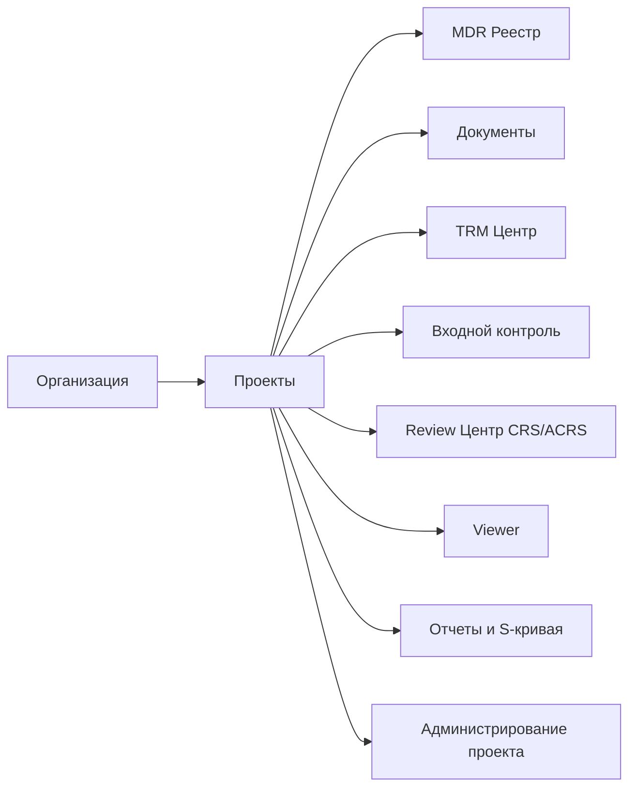

# Системный blueprint: экраны, роли, backend-модули (MVP -> Scale)

Документ продолжает `PROCESS_WORKFLOW.md` и переводит процесс в структуру продукта:
- информационная архитектура (экраны и меню);
- роли и доступы по разделам;
- backend-модули и API-контуры;
- приоритизация MVP.

---

## 1) Информационная архитектура (уровень продукта)

### Рекомендуемое меню
1. **Projects**
2. **MDR Register**
3. **Documents**
4. **Transmittals (TRM)**
5. **Incoming Control**
6. **Review (CRS/ACRS)**
7. **Reports**
8. **Settings**

---

## 2) Карта экранов (UI scope)

## 2.1 Projects
### Экран: Список проектов
- Поиск, фильтры, статусы проекта.
- Карточки/таблица проектов.
- Быстрые метрики: кол-во документов, открытых замечаний, просрочки review.

### Экран: Создание проекта
- Название, коды, даты, участники.
- Выбор активных справочников проекта.
- Базовые шаблоны: TRM/CRS/ACRS/MDR.

### Экран: Настройка проекта
- Матрица распределения документации (кому уходит review).
- Правила сроков и SLA.
- Каналы обмена (портал/email/TDMS-integration).

---

## 2.2 MDR Register (главный рабочий реестр)
### Экран: MDR таблица
- Колонки атрибутов MDR (включая `Document Key`, `Issue Purpose`, `Revision`, `Review Code`, `TRM`).
- План/прогноз/факт по шагам прогресса (10..100).
- Массовые операции: импорт/экспорт, фильтрация, сверка.

### Экран: Карточка MDR-записи
- История изменений атрибутов.
- Связанные ревизии документа, TRM и CRS/ACRS.
- Audit trail (кто и когда менял запись).

---

## 2.3 Documents
### Экран: Реестр документов
- Список документов в рамках проекта.
- Группировка по дисциплине/категории/объекту/подрядчику.
- Статус жизненного цикла и текущая ревизия.

### Экран: Карточка документа
- Метаданные документа.
- Вкладки:
  - `Revisions`
  - `Comments`
  - `Transmittals`
  - `MDR`
  - `History`

### Экран: Загрузка ревизии
- Обязательные поля процедуры:
  - Searchable PDF;
  - редактируемый файл или ZIP;
  - `Issue Purpose`;
  - `Revision Code`.
- Предвалидация перед TRM.

---

## 2.4 Transmittals (TRM)
### Экран: TRM список
- Входящие/исходящие TRM.
- Статусы: Draft, Sent, In Incoming Check, Rejected, Accepted.

### Экран: Создание TRM
- Добавление пакета документов.
- Проверка процедурных ограничений:
  - одна цель выпуска на TRM (кроме SUP/VOID случаев);
  - запрет смешения разных титулов/дисциплин в одном TRM (если так определено настройкой проекта);
  - обязательные атрибуты TRM.

### Экран: Карточка TRM
- Состав пакета.
- События входного контроля.
- Привязка к CRS/ACRS и решениям review.

---

## 2.5 Incoming Control
### Экран: Очередь входного контроля
- Пакеты на первичной проверке DCC/TDO.
- Чек-лист: оформление, нумерация, комплектность, требования TRM.

### Экран: Решение по входному контролю
- `Accept` -> направить в review по матрице.
- `Reject` -> вернуть с причинами.
- При reject: повторная подача с тем же TRM номером.

---

## 2.6 Review Center (CRS/ACRS)
### Экран: Review Inbox (для LR/Reviewers)
- Документы, назначенные по матрице.
- Сроки и приоритеты.

### Экран: CRS редактор
- Комментарии построчно.
- Review Code по документу (AP/AN/CO/RJ).
- Поддержка ссылок на redline вложения.

### Экран: ACRS и повторный выпуск
- Ответ на каждый комментарий.
- Валидация: отправка ACRS только с исправленной ревизией.
- Маршрут на повторное рассмотрение.

---

## 2.7 Viewer
### Экран: Просмотр документа
- Встроенный просмотр PDF в браузере.
- Навигация по страницам, zoom, rotate.
- Привязка комментария к странице/области.

### Экран: Сравнение ревизий
- Side-by-side сравнение PDF.
- Подсветка измененных страниц (минимум для MVP).

---

## 2.8 Reports
### Экран: Прогресс MDR
- План/прогноз/факт.
- S-кривая.
- Drill-down до документа.

### Экран: KPI документооборота
- SLA review.
- Кол-во возвратов на входном контроле.
- Aging открытых замечаний.

---

## 2.9 Settings
### Экран: Роли и доступы
- Назначение ролей на проект.
- Права на действия (view/create/review/approve/admin).

### Экран: Справочники проекта
- Включение только релевантных категорий.
- Деактивация без удаления из исторических записей.

### Экран: Шаблоны
- Шаблоны TRM/CRS/ACRS/MDR.
- Версионирование шаблонов.

---

## 3) Матрица ролей по ключевым действиям

| Действие | Org Admin | Project Admin | DCC/TDO | MDR Specialist | Author | LR/Reviewer | Approver | Viewer |
|---|---|---|---|---|---|---|---|---|
| Создать проект | Y | Y | N | N | N | N | N | N |
| Настроить матрицу распределения | N | Y | Y | N | N | N | N | N |
| Управлять справочниками проекта | N | Y | N | N | N | N | N | N |
| Создавать/редактировать MDR базу | N | Y | N | Y | N | N | N | N |
| Загружать ревизии | N | N | N | N | Y | N | N | N |
| Формировать TRM | N | N | Y | N | Y (ограниченно) | N | N | N |
| Выполнять входной контроль | N | N | Y | N | N | N | N | N |
| Выпускать CRS | N | N | N | N | N | Y | N | N |
| Выпускать ACRS | N | N | N | N | Y | N | N | N |
| Присваивать финальное решение review | N | N | N | N | N | Y | Y | N |
| Согласовывать финальный выпуск | N | N | N | N | N | N | Y | N |
| Смотреть документы/отчеты | Y | Y | Y | Y | Y | Y | Y | Y |

Примечание: финальная матрица утверждается по вашим регламентам ответственности и контракту.

---

## 4) Backend-модули (domain split)

1. **Identity & Access**
   - пользователи, роли, membership по проектам;
   - авторизация действий на уровне проекта.

2. **Project Configuration**
   - профили справочников;
   - матрица распределения;
   - шаблоны и SLA.

3. **Document Core**
   - карточка документа;
   - ревизии, коды ревизий, цели выпуска;
   - вложения (PDF/editable/ZIP).

4. **Transmittal Service**
   - TRM header + items;
   - валидации процедуры;
   - журнал отправок.

5. **Incoming Control Service**
   - чек-лист входного контроля;
   - reject reasons;
   - маршрутизация в review.

6. **Review Service**
   - CRS, CRS items, review codes;
   - ACRS responses;
   - циклы review.

7. **MDR Service**
   - MDR records;
   - plan/forecast/fact by step;
   - сверка с TRM register.

8. **Reporting & Analytics**
   - S-curve;
   - SLA и KPI;
   - выгрузки.

9. **Viewer/Conversion Service**
   - хранение исходника;
   - web-представление;
   - привязка аннотаций.

10. **Audit & Compliance**
    - неизменяемый журнал событий;
    - трассировка решений.

---

## 5) API-контуры (минимум для старта)

- `POST /projects`, `GET /projects/:id`
- `POST /projects/:id/members`
- `GET/PUT /projects/:id/dictionaries`
- `GET/POST /projects/:id/mdr-records`
- `POST /documents`, `POST /documents/:id/revisions`
- `POST /trm`, `GET /trm/:id`, `POST /trm/:id/submit`
- `POST /incoming-check/:trmId/accept|reject`
- `POST /crs`, `POST /crs/:id/items`, `POST /crs/:id/issue`
- `POST /acrs`, `POST /acrs/:id/submit-with-revision`
- `GET /reports/s-curve?projectId=...`
- `GET /viewer/document/:revisionId`

---

## 6) MVP состав (чтобы быстро запуститься)

### Обязательно в MVP
1. Проекты + роли.
2. MDR реестр (минимальный, но с ключевыми полями и историей).
3. Документы и ревизии.
4. TRM и входной контроль.
5. CRS/ACRS цикл.
6. Viewer для PDF.
7. Базовые отчеты (прогресс + просрочки review).

### Можно после MVP
1. Автоматическое сравнение ревизий.
2. Интеграции почты/TDMS/Primavera.
3. Расширенный BI и custom dashboards.

---

## 7) Что отдавать в дизайн и разработку уже сейчас

1. UI wireframes для 9 разделов (из пункта 2).
2. ERD по сущностям из `PROCESS_WORKFLOW.md` + этого документа.
3. Спецификация API на MVP-контур.
4. Матрица ролей и словарь статусов.

