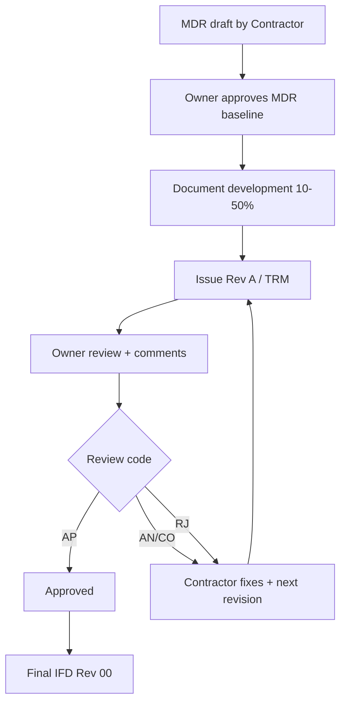
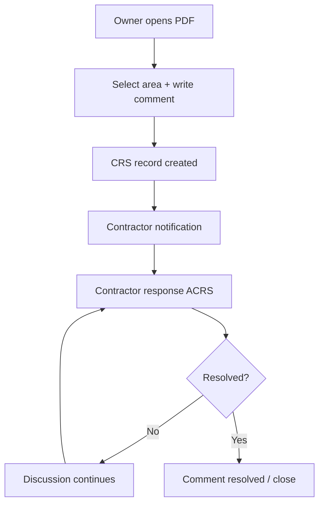
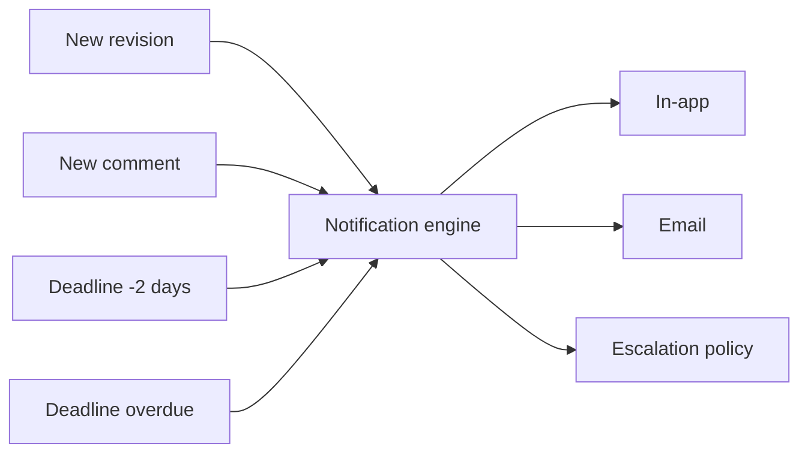

# IvaMaris TDO — архитектура и расширенное ТЗ (MVP + масштабирование)

## 1) Цель системы

Система ТДО (технического документооборота) должна закрывать полный цикл:

1. Формирование и согласование реестра MDR.
2. Разработка документации подрядчиком.
3. Выпуск ревизий (IFR/IFD и т.д.).
4. Комментирование в контексте PDF (замечания + область на листе).
5. Ответы подрядчика и трекинг статусов AP/AN/CO/RJ.
6. Уведомления и контроль сроков.

---

## 2) Роли и зона ответственности

- **Admin**: управление пользователями, статусами, системными правилами.
- **Contractor Manager/Author**: создание MDR, документов, ревизий, ответы на комментарии.
- **Owner Manager/Reviewer**: проверка ревизий, комментарии, согласование.
- **Viewer**: чтение.

Доступ только по email + password + RBAC.

---

## 3) Технологические варианты

## Backend

### Вариант A (рекомендуемый)
- **FastAPI + PostgreSQL + SQLAlchemy + Redis + MinIO/S3**
- Плюсы: быстрый старт, чистое API, хорошая производительность для data-heavy сценариев.
- Минусы: нужно дисциплинированно проектировать доменную модель и миграции.

### Вариант B
- **NestJS + PostgreSQL + Prisma**
- Плюсы: строгая модульность и популярность в JS-экосистеме.
- Минусы: чуть выше порог архитектурной сборки для enterprise-правил workflow.

## Frontend

### Вариант A (рекомендуемый)
- **React + TypeScript + Ant Design**
- Плюсы: быстрый enterprise UI, много готовых компонентов (таблицы, формы, модальные окна).
- Минусы: размер bundle выше, чем у headless-комбинаций.

### Вариант B
- **React + TypeScript + MUI**
- Плюсы: гибкая дизайн-система.
- Минусы: чуть больше ручной настройки для плотных бизнес-экранов.

## PDF аннотации

- **MVP**: `react-pdf` + `konva` (или canvas-overlay).
- **Enterprise upgrade**: PSPDFKit/PDFTron (если нужна электронная подпись, продвинутый review trail, rich-form editing).

---

## 4) Модульная архитектура

1. **AUTH** — вход, токены, роли.
2. **MDR** — реестр и атрибуты документа.
3. **DOCUMENT** — карточка документа, связь с MDR.
4. **REVISION** — версии, TRM, review deadline.
5. **COMMENT (CRS/ACRS)** — замечания, обсуждения, ответы.
6. **WORKFLOW** — справочник статусов (AP/AN/CO/RJ), редактируемые правила.
7. **NOTIFY** — уведомления (in-app/email/в будущем telegram).
8. **AUDIT** — журнал действий.
9. **REFERENCE/CONFIG** — управляемые справочники и правила.

---

## 5) Схемы процессов

## 5.1 Основной жизненный цикл

## 5.2 Комментарии в PDF

## 5.3 Уведомления и дедлайны

---

## 6) Модель данных (ядро)

- `users`
- `mdr_records`
- `documents`
- `revisions`
- `comments` (parent_id для ответов)
- `workflow_statuses` (AP/AN/CO/RJ + редактируемость)
- `notifications`
- `audit_logs`

Принцип:
- MDR = мастер-реестр;
- Document = бизнес-единица;
- Revision = версия и факт отправки/рассмотрения;
- Comment = вопрос/замечание/ответ в контексте ревизии.

---

## 7) API контракты (реализовано в MVP)

- `/api/v1/auth/*` — login/refresh/me
- `/api/v1/users` — управление пользователями (admin)
- `/api/v1/mdr` — CRUD реестра
- `/api/v1/documents`, `/api/v1/revisions`, `/api/v1/comments` — контур обсуждения
- `/api/v1/workflow/statuses` — настраиваемые статусы
- `/api/v1/notifications` — уведомления

---

## 8) Нефункциональные требования

- RBAC на уровне endpoint.
- Audit trail критичных действий.
- Идемпотентность операций импорта/экспорта.
- Горизонтальное масштабирование backend (stateless).
- Хранение файлов отдельно от БД (S3/MinIO).
- Резервное копирование БД + object storage.

---

## 9) Поэтапная реализация (модули)

### Этап 1 — Foundation (готов в этом репозитории)
- Auth + Roles
- MDR + Documents + Revisions
- Comments/Responses
- Workflow statuses AP/AN/CO/RJ
- In-app notifications
- Docker запуск

### Этап 2 — Review UX
- Полноценный PDF viewer с геометрией аннотаций
- Сроки, SLA, напоминания/эскалации
- Email templates и очереди задач

### Этап 3 — Enterprise
- Transmittal module (TRM register + attachments)
- Отчеты/S-curve
- Расширенный audit + compliance export
- SSO/AD и двухфакторная аутентификация

---

## 10) Архитектурные решения по статусам

Фиксированные коды в бизнес-смысле:
- `AP` — Approved
- `AN` — Approved as Note
- `CO` — Commented
- `RJ` — Rejected

Но отображение и правила переходов должны храниться в БД и быть редактируемыми Admin (что уже заложено через `workflow_statuses`).

---

## 11) Риски и компенсации

- **Риск:** разночтения процедуры между проектами.  
  **Решение:** версия workflow-rule per project.
- **Риск:** потеря контекста комментариев к PDF-области.  
  **Решение:** хранить координаты + snapshot страницы.
- **Риск:** срыв сроков ревью.  
  **Решение:** автоматические эскалации и дашборд overdue.

